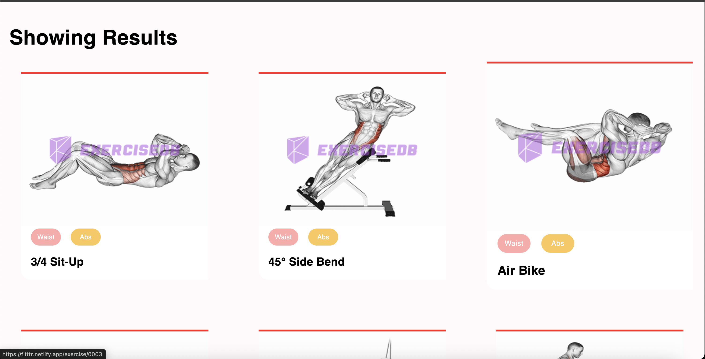
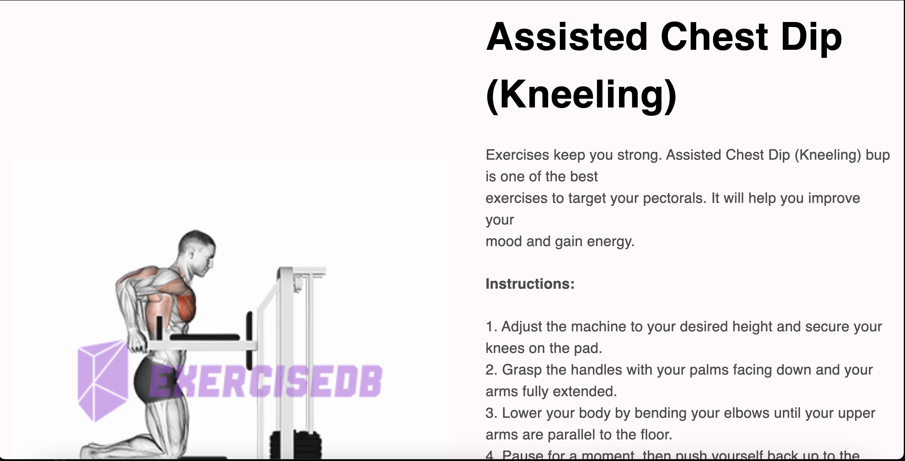
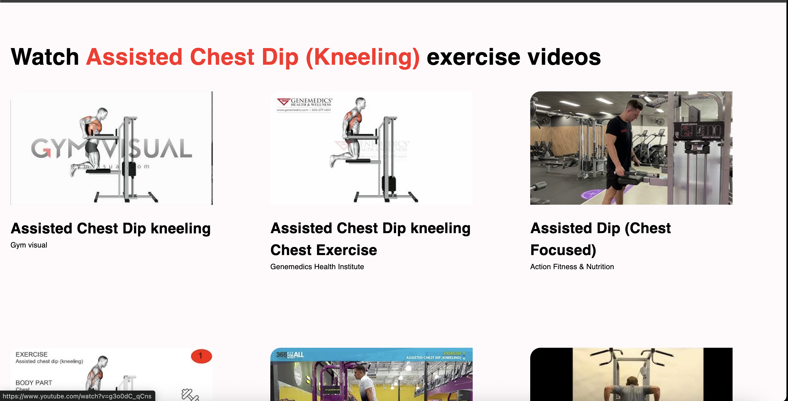

# Fitness App

The **Fitness App** is your ultimate companion for discovering exercises tailored to your fitness goals. Whether you're looking to target specific body parts or searching for exercises by name, this app has you covered. With a sleek and user-friendly interface, the app provides detailed exercise instructions, visuals, and related information to help you stay fit and motivated.

---

## 🌟 About the Project

The Fitness App is designed to make fitness accessible and engaging for everyone. Key features include:

- **Search by Body Part**: Explore exercises based on specific body parts like arms, legs, chest, and more.
- **Search by Name**: Quickly find exercises by typing their names in the search bar.
- **Detailed Exercise Information**: View exercise instructions, target muscles, and equipment required.
- **Visual Guidance**: Each exercise comes with an animated GIF to demonstrate proper form.
- **Responsive Design**: The app is fully responsive and works seamlessly on all devices.

This app is perfect for fitness enthusiasts, beginners, and anyone looking to improve their health and well-being.

---

## 📸 Screenshots

### Home Page



### Exercise Page




## Deployed Link

Check out the live app [here](https://fitttr.netlify.app/).

## How to Run Locally

To run the app locally, follow these steps:

1. Clone the repository:
   ```sh
   git clone https://github.com/Madhav243/fitness-app.git
   ```
2. Navigate to the project directory:
   ```sh
   cd fitness-app
   ```
3. Install dependencies:
   ```sh
   npm install
   ```
4. Start the development server:
   ```sh
   npm start
   ```

## Available Scripts

In the project directory, you can run:

### `npm start`

Runs the app in the development mode.\
Open [http://localhost:3000](http://localhost:3000) to view it in the browser.

The page will reload if you make edits.\
You will also see any lint errors in the console.

### `npm test`

Launches the test runner in the interactive watch mode.\
See the section about [running tests](https://facebook.github.io/create-react-app/docs/running-tests) for more information.

### `npm run build`

Builds the app for production to the `build` folder.\
It correctly bundles React in production mode and optimizes the build for the best performance.

The build is minified and the filenames include the hashes.\
Your app is ready to be deployed!

See the section about [deployment](https://facebook.github.io/create-react-app/docs/deployment) for more information.

### `npm run eject`

**Note: this is a one-way operation. Once you `eject`, you can’t go back!**

If you aren’t satisfied with the build tool and configuration choices, you can `eject` at any time. This command will remove the single build dependency from your project.

Instead, it will copy all the configuration files and the transitive dependencies (webpack, Babel, ESLint, etc) right into your project so you have full control over them. All of the commands except `eject` will still work, but they will point to the copied scripts so you can tweak them. At this point you’re on your own.

You don’t have to ever use `eject`. The curated feature set is suitable for small and middle deployments, and you shouldn’t feel obligated to use this feature. However we understand that this tool wouldn’t be useful if you couldn’t customize it when you are ready for it.

## Learn More

You can learn more in the [Create React App documentation](https://facebook.github.io/create-react-app/docs/getting-started).

To learn React, check out the [React documentation](https://reactjs.org/).
